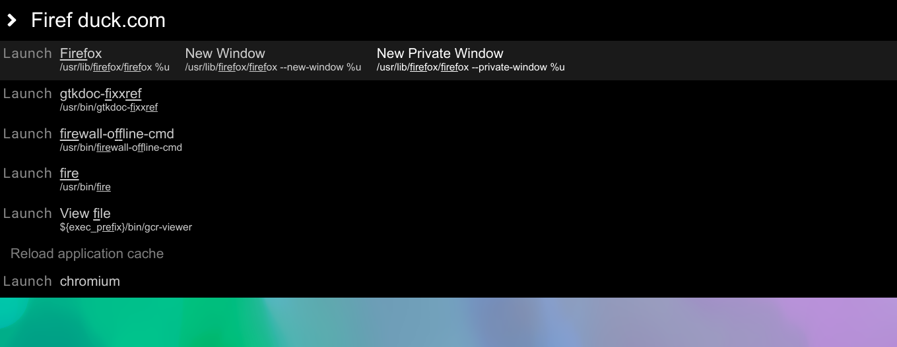

# Vonal

Vonal is an electron based launcher app for linux like rofi, albert, hain, etc... 




## **Wait** ... Electron based? 
Yes, but it is quite fast and you can modify it easly.

## Why? 

I really wanted to make a launcher that doesn't require low level languages to write plugins and allows to make plugins as easily as it possible.
Here it is an example:

```jsx
// ~/.config/vonal/plugins/example-vonal-plugin/index.js
export default (query) => {

    if (query.match(/keyword to trigger/))
        return <div className="row">
            triggered
        </div>

    return null

}
```

## Installation & Usage

Make sure, you've installed one of npm, or yarn

### **1.** Install dependencies
Clone this repository, and go to the cloned project folder 

```bash
npm i # to install dependencies
```

### **2.** Do a test run

```bash
# You have to make a FIFO pipe that you can use to send commands to Vonal.
# It's a bit unique design, but this way you can use your own keyboard daemon without relaunching the app.
mkfifo VONALPIPE 

# Build & run the application with `-p LOCATION_OF_PIPE`
npm start -- -p ./VONALPIPE 

# GREAT TIP:
# Once you've built the application, 
# you can run it by `electron . -p LOCATION_OF_PIPE`. 
# This way you don't need to pack the code.

# Now, the application is running.
# You can start sending commands to it.
echo 'show' > ./VONALPIPE 
echo 'hide' > ./VONALPIPE # but ESC will also hide it.
echo 'restart' > ./VONALPIPE 
echo 'reload_plugins' > ./VONALPIPE
echo 'quit' > ./VONALPIPE 

# GREAT TIP: 
# You simply can set a shortcut for these operations.
# At least for 'show'.
```

### **3.** Install plugins

By default, Vonal is just a textbox and it won't show any results.  
**To install plugins, make this folder:** `~/.config/vonal/plugins` **, and clone the plugins into it, then follow their instructions.**  
Currently plugins are actively developed, but you can find them here:
https://github.com/vonal-project

### Create a package for linux (optional)
While you are able to launch the app with `electron . -p LOCATION_OF_PIPE`, you don't need to wait this process.

```bash
npm run package-linux # to create a package for linux
# when you've got any type of executable you need to pass -p LOCATION_OF_PIPE
# in the same way described in STEP 2.
```

## *Contributing*

*Feel free to open any issues.*  
*Great pull requests for merge will be choosed.*  
*You can* [Dive into plugins](docs/DIVE_INTO_PLUGINS).  
*The asker who wins.*  
 <sub> - sorry for this horrible poem</sub> 
